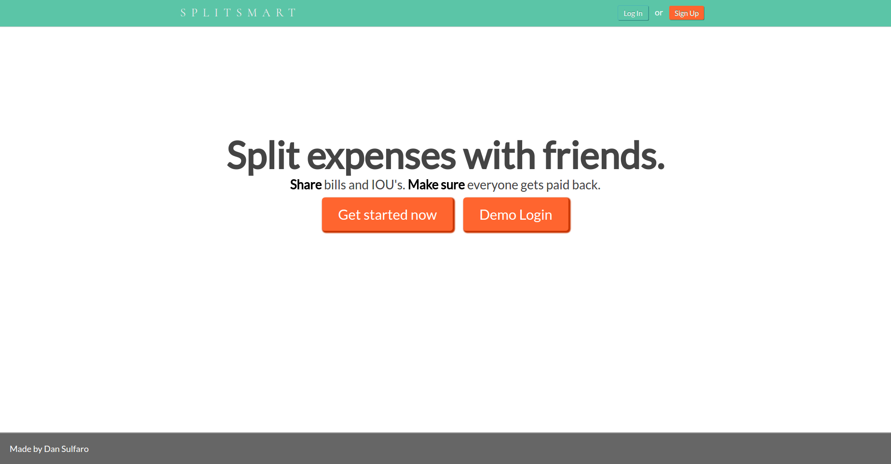
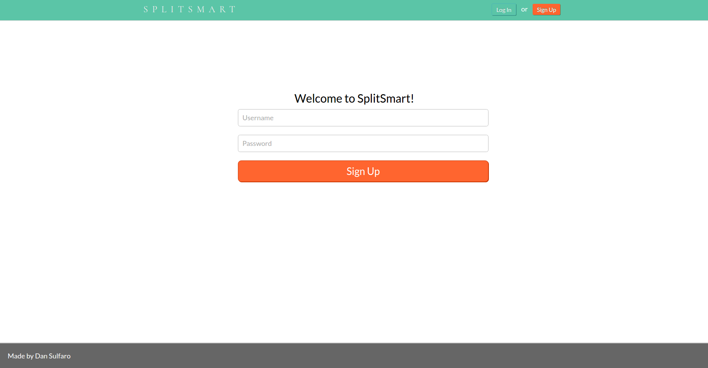
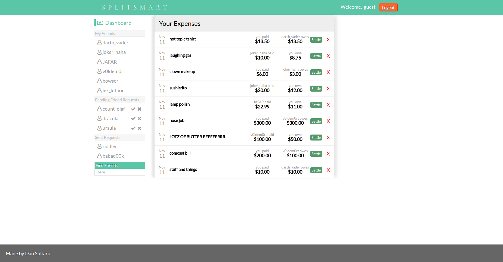
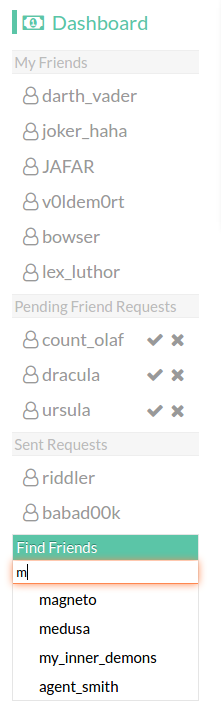
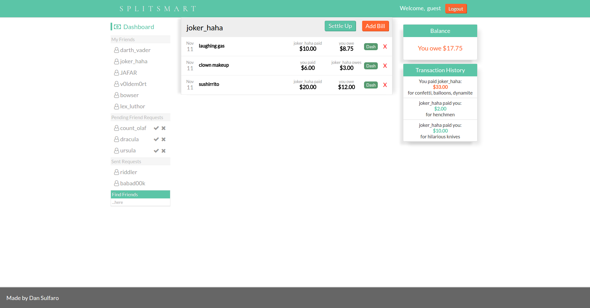
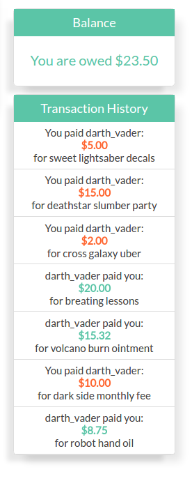
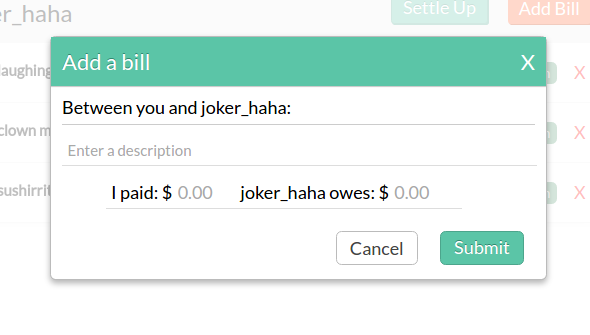

## Splitsmart
[Splitsmart Live] (http://www.splitsmart.xyz/#/)

Splitsmart is a full-stack web application inspired by Splitwise. Ruby on Rails handles the backend with a PostgreSQL database, and a React/Redux frontend.

### User Auth

Users can create an account or sign in to an existing account with the login form on the navigation bar. Accounts here are simply a username and password but can easily be expanded to include email and first/last name.

### Dashboard

Upon logging in or signing up, the user is presented with the friends pane to the left and the expenses feed in the center. The expenses list who lent money, who owes money, the amount to be paid, and two buttons: settle and X. The settle button takes the user to the friend's page and the X allows the user to delete and expense. A user can also leave comments on an expense by clicking on it.

### Friending

To the right is the friends pane. Clicking Dashboard will take you to your expenses feed. Below that is a list of users that the user is currently friends with; clicking on one will take you to a friend's page. Beneath that is the Pending Friend Requests. Here the user can see the friend requests that other users have sent to them; the current user can except or deny these requests. Then there are the sent requests which are friend requests sent by the current user. Finally, there's the user search with which the user can search for new friends among all of the users that they are not currently associated with.

### Friends Page

Here is what the user sees when clicking on a friend's name from the friend's pane or the settle button on the main expenses feed. These are all of the expenses between the current user and their currently selected friend. Here, the user can Settle Up a bill which marks them as paid and transfers them to the transaction history to the right. They can add a bill, get taken back to the dash using the Dash button, or delete a bill.

### Detail Pane

To the right, we have the detail pane which list the current balance (orange if the user owes money and blue/green if they are owed something by that friend). Below that is the transaction history which lists all of the paid transactions between a user and that current friend.

### Add Bill

Simple form for filling out a bill complete with error handling.

## Features to be added
- Groups and splitting bills between multiple people.
- Invite friends via email.
- Venmo account support.
- Email reminders.
- 

